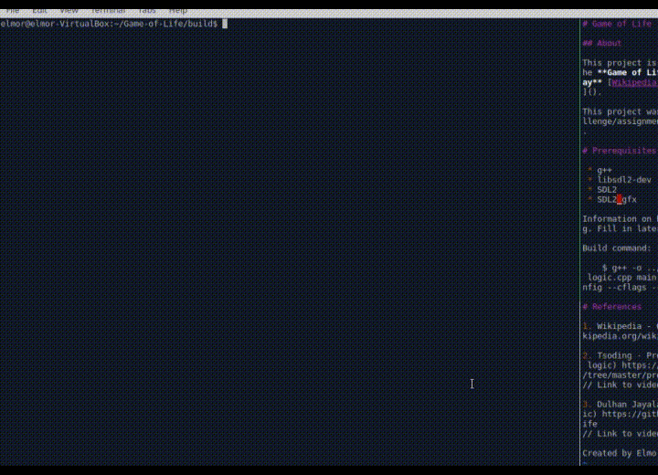

# Game of Life

## About

This project is a C++ implementation of the **Game of Life** by **John Horton Conway** [Wikipedia article on "Game of Life"]().

This project was created for a coding challenge/assignment by **Buutti Education**.

# Building and launching the game

You need to compile the game to run it. You need the following programs to run it on a **Linux**-system:

 * g++
 * pkg-config
 * libsdl2-dev
 * libsdl2-gfx-dev

You can install them with

    $ sudo apt update
    $ sudo apt install -y g++ pkg-config libsdl2-dev libsdl2-gfx-dev

Clone this repository:

    $ git clone https://github.com/rootElmo/Game-of-Life

Build the program by going into the src folder and use g++:

    $ cd src/
    $ g++ -o ../build/game-of-life game.h logic.cpp main.cpp rendering.cpp `pkg-config --cflags --libs sdl2 SDL2_gfx`

Now if everything went OK, you can access the **build** folder and run the game:

    $ cd ../build
    $ ./game-of-life

# Playing the game

At first the game presents you with a blank screen with a grid. You can set the **cells** either "alive" (white) or "dead" (black). You can now manipulate the game with the following inputs:

 * **R** - resets all **cells** to initial state
 * **Space** - starts automatic iteration of generations. Automatic iteration can be turned off by pressing **space** again, or by pressing **R**
 * **Right arrow key** - iterate through generations one by one

# References

1. Wikipedia - Game of Life https://en.wikipedia.org/wiki/Conway%27s_Game_of_Life

2. Tsoding - Profun (using SDL, rendering logic) https://github.com/tsoding/profun/tree/master/procedural
// Link to video later

3. Dulhan Jayalath - GameOfLife (Game logic) https://github.com/armytricks/GameOfLife
// Link to video later

Created by Elmo Rohula 2021
